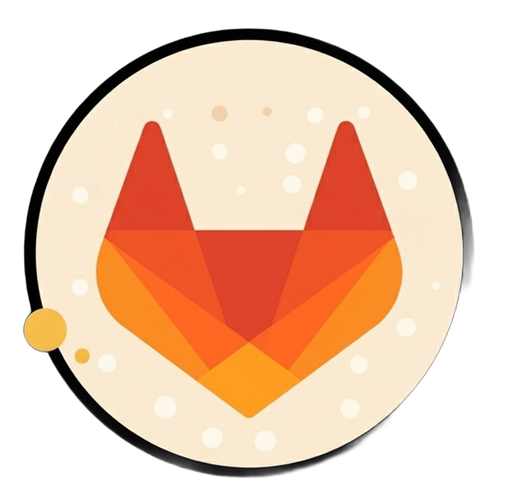

# 💫 Salut, je suis Luz Rivera !

  

  <strong>🚀 Full Stack Web Developer Apprentice @ ENAC | Bachelor 3 Student @ EPSI 🚀</strong>

<h4 align="center">I am currently studying for a Bachelor's degree (B3 - CDA) at <strong>EPSI</strong> and working as a Full Stack Web Developer Apprentice at <strong>ENAC</strong> (École Nationale de l'Aviation Civile). 
I am a persistent and solution-oriented developer who loves tackling complex technical challenges, building scalable web applications, and integrating AI workflows.</h4>
 

<h2 id="️-presentation">👨🏽‍💻 About Me</h2>

* **👨‍💻 Current Status:** Bachelor 3 Student at **EPSI** | Full Stack Apprentice at **ENAC**.
* **🏛️ Professional Focus:** Developing & maintaining HR web applications (Laravel / Vue.js) within the IT Department (PSI) at ENAC.
* **🌱 Tech Stack & Interests:** Deepening my expertise in the **PHP ecosystem** (Laravel, Symfony) alongside a strong background in **React**, **Django**, and **Flutter**.
* **🔨 Major Solo Project:** **À la brasa** — a full-scale B2G web app for discovering and managing public barbecue grills in Haute-Garonne, France. End-to-end solo development using **Symfony**, **Twig**, **Doctrine ORM**, and **OpenStreetMap APIs**.
* **🤖 AI Integration:** Leveraging Generative AI for code generation, automated testing, documentation, and workflow optimization.
* **💬 Let's chat:** About web architecture, API integrations, Laravel/Vue.js ecosystems, or tech in general!

---

<h2 id="-projects">📂 Projects & Experiences</h2>

#### 🏢 Professional & Major Projects
* ✈️ **ENAC (PSI - SG):** **Full Stack Apprentice.** Developing and maintaining HR web applications (`BaseRH` and `ENIX`) using **PHP 8.2 (Laravel)**, **Vue.js**, and AI-assisted development workflows.
* 🥩 **À la brasa (GitHub):** **Major Solo Project.** Full-scale B2G web app for discovering and managing public barbecue grills in Haute-Garonne. Independent end-to-end development using **Symfony**, **Twig**, **Doctrine ORM**, and **OpenStreetMap APIs**.
* 📱 **Gullu App (GitLab):** **Former Full Stack Intern.** Developed a social & travel mobile application featuring cross-platform components with **Flutter** and backend logic with **Django**.
* 🎬 **marsAI (GitHub):** Full-Stack platform for an international film festival. Managed the complete lifecycle from **database modeling (Sequelize)** to **Docker** deployment and **REST API** architecture.
* 🏛️ **Médiathèque (GitHub):** Multimedia management system built with **PHP (MVC)**, focusing on clean architecture, security, and session management.

#### 🧪 Featured Public Repositories (Learning & Exercises)
* 🚀 **[Earth Defender](https://github.com/LuzRivera154/earth-defender):** 2D Game built with **Object-Oriented Programming** (Classes, Inheritance, Polymorphism).
* ☀️ **[Project Météo](https://github.com/LuzRivera154/project-meteo):** Weather app using **Open-Meteo API** with IP-based geolocation fallback.
* 📱 **[React ThreadFront](https://github.com/LuzRivera154/module5-react-threadfront):** Social media SPA built with **React + Vite**.
* *... and many more exercises and mini-projects below!*

 

<h2 id="-github-stats">📊 Github Stats</h2>

  

🛠️ My Skills (Languages & Tools)
👉 Programming Languages

👉 Frameworks & Frontend

👉 Backend & Databases

👉 Tools, Methods & AI

  <i>... and constantly expanding my horizons with new libraries, frameworks, and AI-driven development tools! 🚀</i>

<h2 id="️-lets-connect">🙋‍♀️ Let’s Connect</h2>

  
  
  
  

<table>
  <tr>
    <td width="50%">
      <h3>📍 Current Info</h3>
      <ul>
        <li><b>Location:</b> 31400 Toulouse, France</li>
       <li><b>Work preference:</b> Apprenticeship (Flexible rhythm: 1w/3w, 1w/2w, or 2d/3d)</li>
        <li><b>Last Edited:</b> 29/04/2026</li>
      </ul>
    </td>
    <td width="50%" align="right">
      
    </td>
  </tr>
</table>
